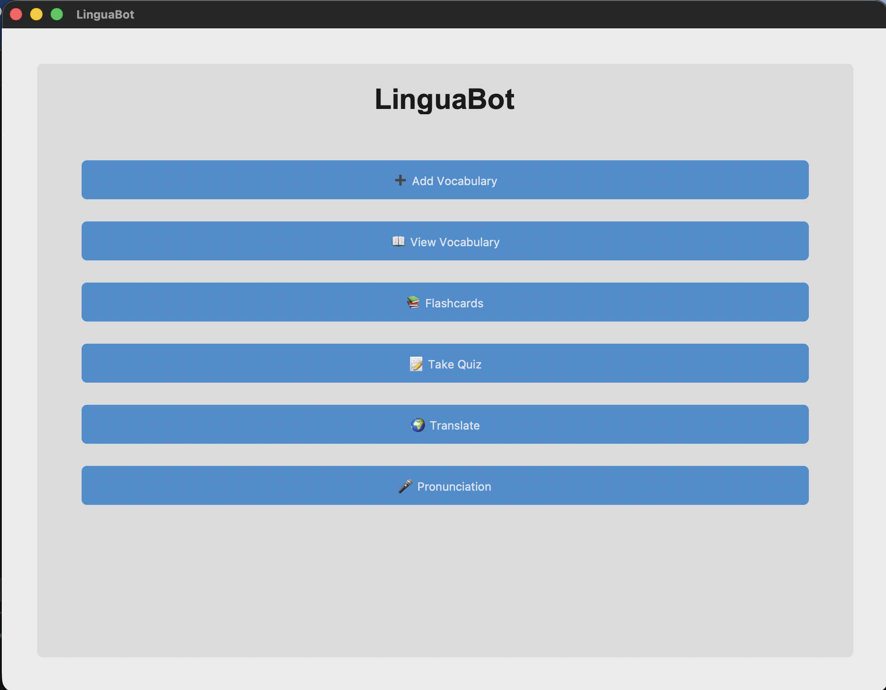
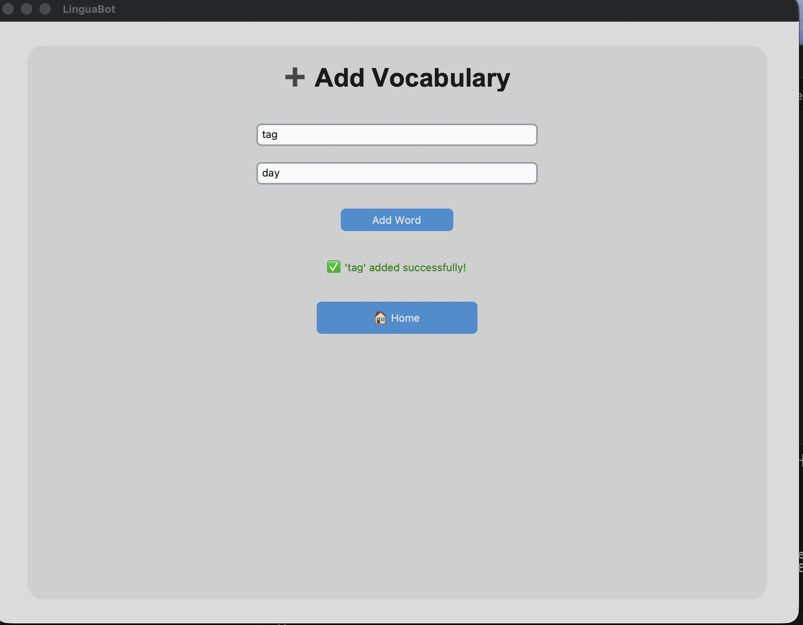
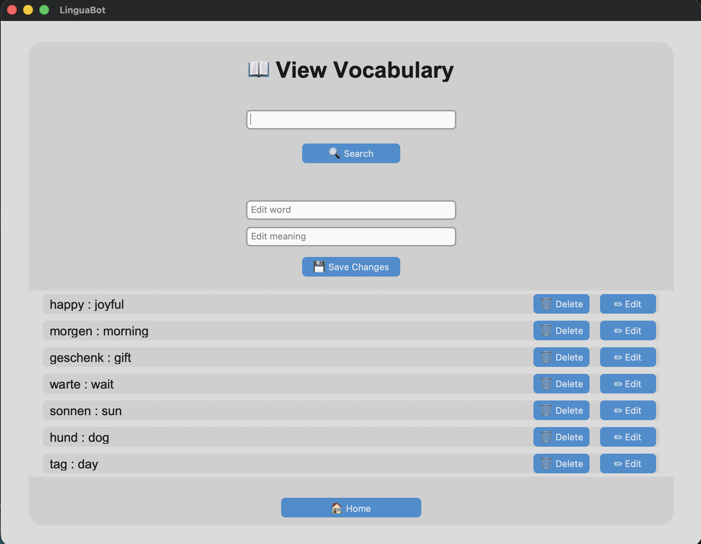
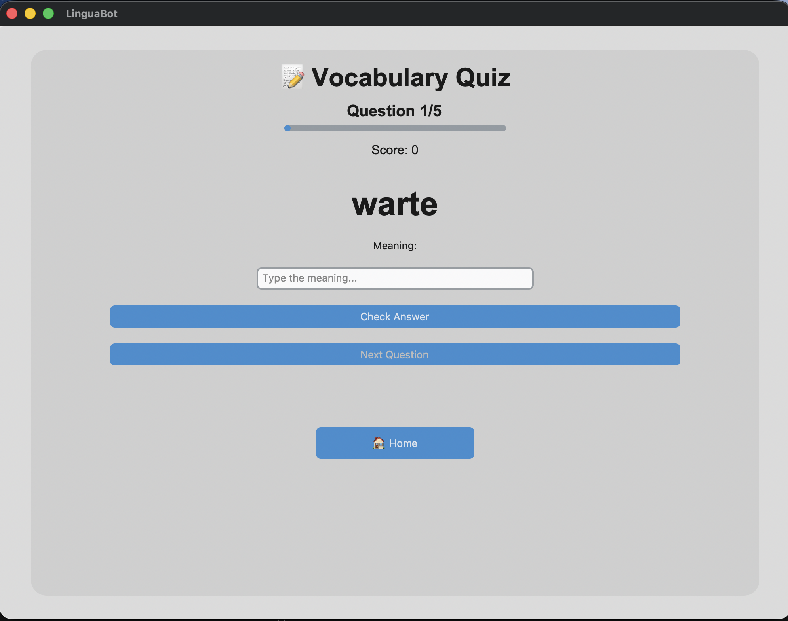
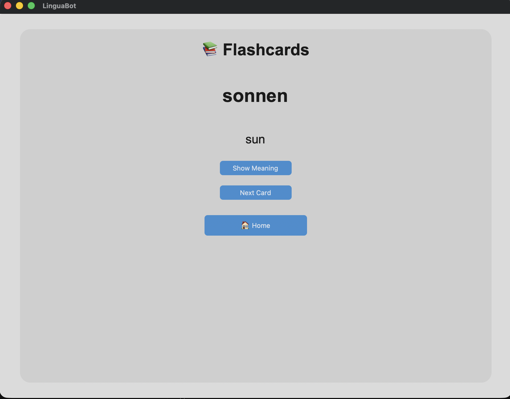
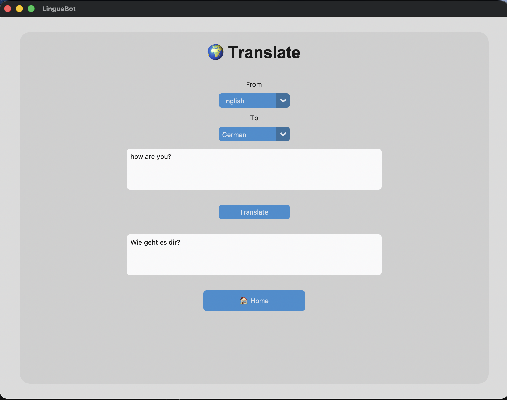
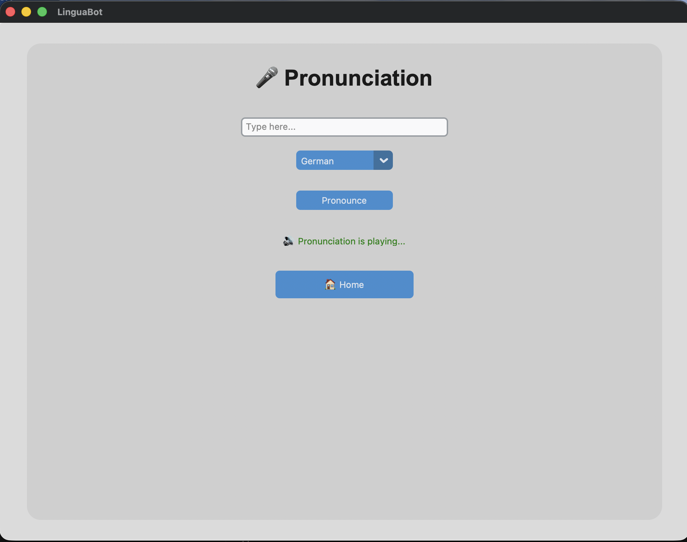

# LinguaBot

LinguaBot is a small desktop language-learning app I built with Python and CustomTkinter.

I made it as a way to practice Python while building something I could actually use for learning vocabulary and languages. The app keeps vocabulary locally and includes a few different ways to practice it.

## What it can do

- Add new vocabulary words and their meanings
- View saved vocabulary
- Search through vocabulary
- Edit and delete saved words
- Practice vocabulary with a quiz
- Use flashcards for revision
- Translate text between different languages
- Listen to the pronunciation of words and sentences
- Keep vocabulary saved locally in a JSON file

## Screenshots

### Home



### Add Vocabulary



### View Vocabulary



### Quiz



### Flashcards



### Translation



### Pronunciation



## Built with

- Python
- CustomTkinter
- deep-translator
- gTTS

The vocabulary is stored locally in a JSON file.

## Project structure

```text
linguabot_desktop/
│
├── app.py
├── requirements.txt
├── data/
│   └── vocabulary.json
│
├── pages/
│   ├── base_page.py
│   ├── components.py
│   ├── flashcards.py
│   ├── home.py
│   ├── page_manager.py
│   ├── pronunciation.py
│   ├── quiz.py
│   ├── translate.py
│   ├── view_vocabulary.py
│   └── vocabulary.py
│
├── services/
│   ├── pronunciation_service.py
│   ├── translate_service.py
│   └── vocabulary_service.py
│
├── assets/
│   └── screenshots/
│
└── tests/
##Running it
Clone the repository and open the project folder.
Create and activate a virtual environment:
python -m venv .venv

Activate it on macOS/Linux:
source .venv/bin/activate

Install the required packages:
pip install -r requirements.txt

Then run:
python app.py

## A few things I learned

While building LinguaBot, I worked with:

- CustomTkinter layouts and widgets
- Separating UI code from service code
- Saving and loading data with JSON
- Page navigation between different screens
- Calling translation and text-to-speech services
- Basic testing
- Git and GitHub
This project started as a simple language-learning idea and gradually became a larger Python desktop application.

##Author
Sakeena Saleem
